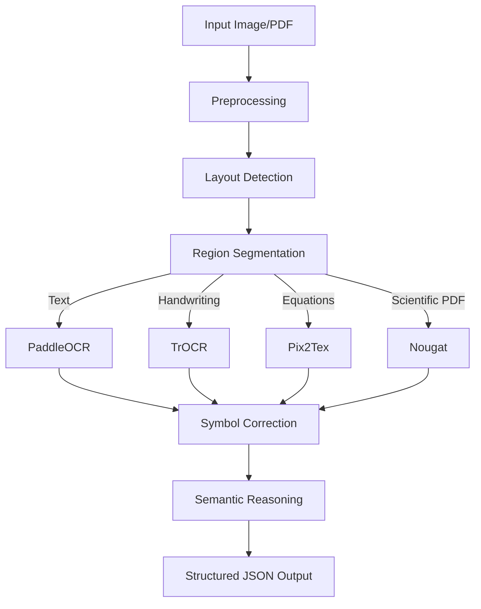

# Improved OCR System Architecture

## Overview
This architecture builds on Mathpix's modular pipeline, adding enhanced reasoning, assignment understanding, and modularity. It processes images/PDFs of assignments into structured JSON outputs.

### Key Features
- **Preprocessing**: Deskewing, noise removal, adaptive thresholding.
- **Layout Detection**: Detects paragraphs, equations, tables, diagrams, and question blocks.
- **OCR Routing**: Routes regions to specialized OCR models.
- **Math OCR**: Converts equations to LaTeX.
- **Symbol Correction**: Corrects OCR errors using grammar rules and LLMs.
- **Semantic Reasoning**: Extracts questions, problem types, and solution steps.

## Pipeline Diagram


## Modules

### 1. Preprocessing
- **Techniques**: Deskewing, perspective correction, noise reduction, adaptive thresholding.
- **Tools**: OpenCV, scikit-image.

### 2. Layout Detection
- **Models**: LayoutLMv3, Detectron2.
- **Output**: Bounding boxes with region types (e.g., text, equations).

### 3. OCR Routing
- **Logic**:
  - Text → PaddleOCR.
  - Handwriting → TrOCR.
  - Equations → Pix2Tex.
  - Scientific PDFs → Nougat.

### 4. Math OCR
- **Model**: Pix2Tex.
- **Output**: LaTeX strings.

### 5. Symbol Correction
- **Methods**: Grammar rules, LLM-based correction.

### 6. Semantic Reasoning
- **Tasks**:
  - Question extraction.
  - Problem classification.
  - Step detection.
- **Model**: Instruction-tuned LLM.

## Outputs
- **Structured JSON**:
```json
{
  "question": "Solve x^2 + 5x + 6 = 0",
  "latex": "x^2 + 5x + 6 = 0",
  "problem_type": "quadratic_equation",
  "solution_steps": [],
  "confidence": 0.92
}
```